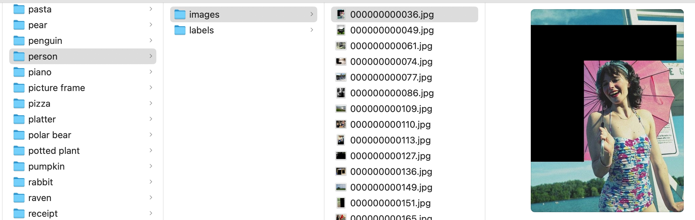
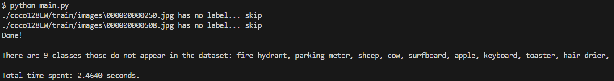

# Data clean
- [Data clean](#data-clean)
	- [Execution Environment](#execution-environment)
	- [How to Run](#how-to-run)
	- [Example](#example)
	- [Execution Result](#execution-result)

## Execution Environment
- Conda environment: `conda env create -f environment.yml`
- Python Package: `pip install -r requirements.txt`

## How to Run
- Download dataset: [COCO128](https://www.kaggle.com/datasets/ultralytics/coco128)
- Set images, labels and classes files path on `main.py: line 108-110`
- `python main.py`
- all result save in `output_path` on `main.py: line 111`. Example:

	

## Example
In the image below, the main category is "person". The other category is "umbrella". The umbrella should be filled in black, but the black area should not block the person.

## Execution Result
- Total time spent: 2.4640 seconds.
- Image no.250 and no.508 have no label.
- There are 9 classes those do not appear in the dataset:
  - fire hydrant
  - parking meter
  - sheep
  - cow
  - surfboard
  - apple
  - keyboard
  - toaster
  - hair drier

